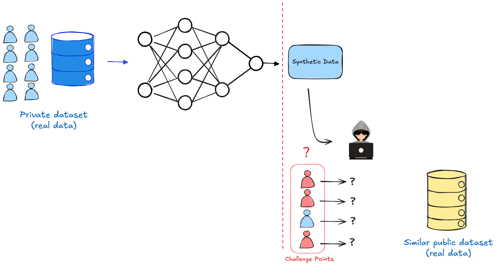
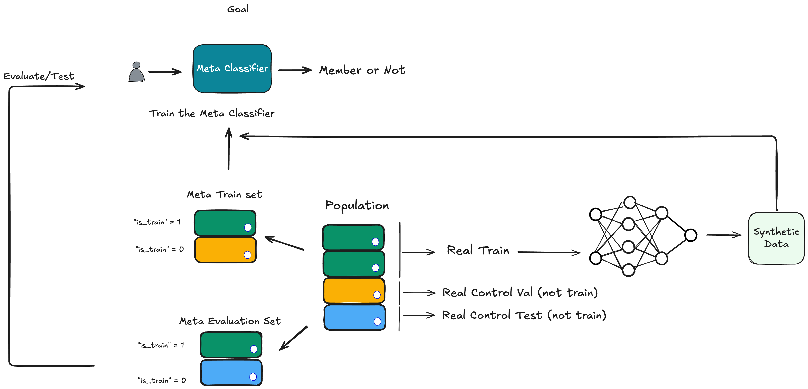
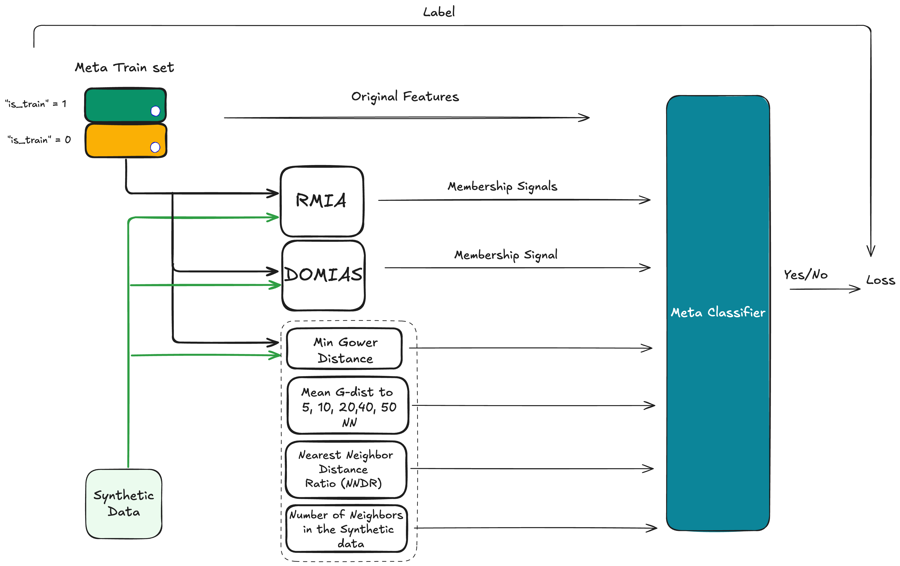

# Ensemble Attack

## Data Processing
As the first step of the attack, we need to collect and split the data. The input data collected from all the attacks provided by the MIDST Challenge should be stored in `data_paths.data_paths` as defined by `config.yaml`. You can download and unzip the resources from [this Google Drive link](https://drive.google.com/drive/folders/1rmJ_E6IzG25eCL3foYAb2jVmAstXktJ1?usp=drive_link). Note that you can safely remove the provided shadow models with the competition resources since they are not used in this attack.

Make sure directories and JSON files specified in `data_paths` and  `data_processing_config` configurations in `examples/ensemble_attack/config.yaml` exist.

To run the whole data processing pipeline, run `run_attack.py` and set `pipeline.run_data_processing` to `true` in `config.yaml`. It reads data from `data_paths.midst_data_path` specified in config, and populates `data_paths.population_data` and `data_paths.processed_attack_data_path` directories.

Data processing steps for the MIDST challenge provided resources according to Ensemble attack are as follows:

**Step 1**:
Collect all the **train data** from all the attack types (every train folder provided by the challenge) including black-box and white-box attack. `population_all.csv` will include a total of `867494` data points. To alter the attack types for train data collection, change `data_processing_config.data_processing_config` in `config.yaml`.

**Step 2**:
 Collect all the **challenge data points** from `train`, `dev` and `final` folders of `tabddpm_black_box`.  `challenge_points_all.csv` will include a total of `13896` data points.

**Step 3**:
 Save population data without and with challenge points. `population_all_no_challenge.csv` will include a total of `855644` data points, and `population_all_with_challenge.csv` will include a total of `869540` data points.

**Note**
`population_all_with_challenge.csv` is used to create real train and test data. Note that a random subset of `40k` data points are sampled from `population_all_with_challenge.csv` and used as population (or real data). You can change the number of random samples by changing `data_processing_config.population_sample_size` in `config.yaml`.

### Run the script
To run the steps first make sure to activate your virtual environment and adjust `config.yaml`. Then run the following from the top directory of the library:


```python

python -m examples.ensemble_attack.run_attack

```

Or you can directly run the bash script:

```bash
 ./examples/ensemble_attack/run.sh
```


# Terminology

### Figure 1: Black-Box Membership Inference Attack
- Private dataset (real data): Training data owned by a company or an entity used to train a synthetic data generator model.

- Synthetic dataset (not real): The generated data by the data generator model. This dataset is the only thing published by the company in a black-box setting.

- Challenge dataset: A set of data points the attacker wants to test for membership, i.e., whether they were part of the private training data of the generator model.

- Public dataset (real data): A dataset that is either similar to the private dataset or comes from the same source but is publicly available.

- Attacker goal: Determine whether each data point in the challenge dataset is present in the private dataset.

- **Population** dataset in **Ensemble Attack**: all real data available to the attacker, including the public dataset and the challenge data points provided by the MIDST competition, are combined into a dataframe called the population dataset. The attacker uses this dataset to simulate the black-box setting and train a meta-classifier. For details, see Figure 2




### Figure 2: Ensemble Attack Data
The following diagram illustrates how the Ensemble Attack constructs meta-train and meta-evaluation datasets for training the meta-classifier.
When building the meta-train dataset (a labeled challenge dataset used for training), we ensure the is_train labels are balanced. The same balancing applies to the meta-evaluation dataset.




### Figure 3: Ensemble Attack Pipeline
This diagram shows how membership signals (features) are generated to train the meta-classifier. These membership signals heavily rely on the similarity of each train data sample (from meta train dataset) to samples of the Synthetic dataset measured by the Gower distance.


